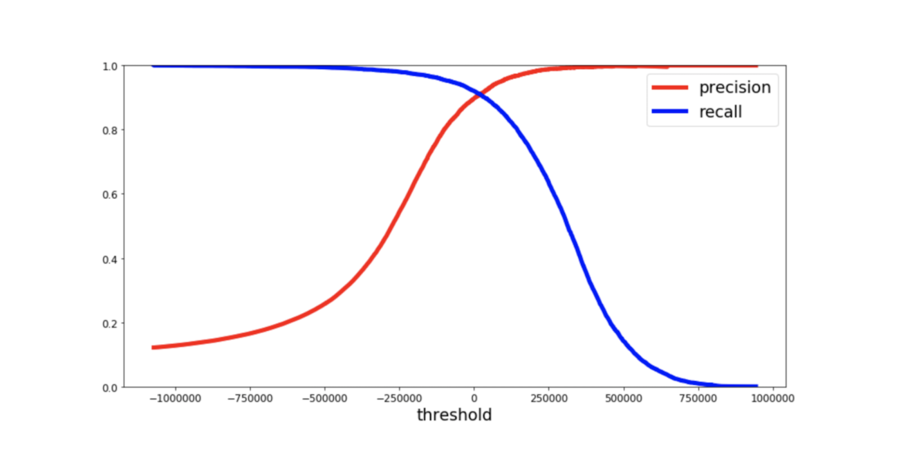
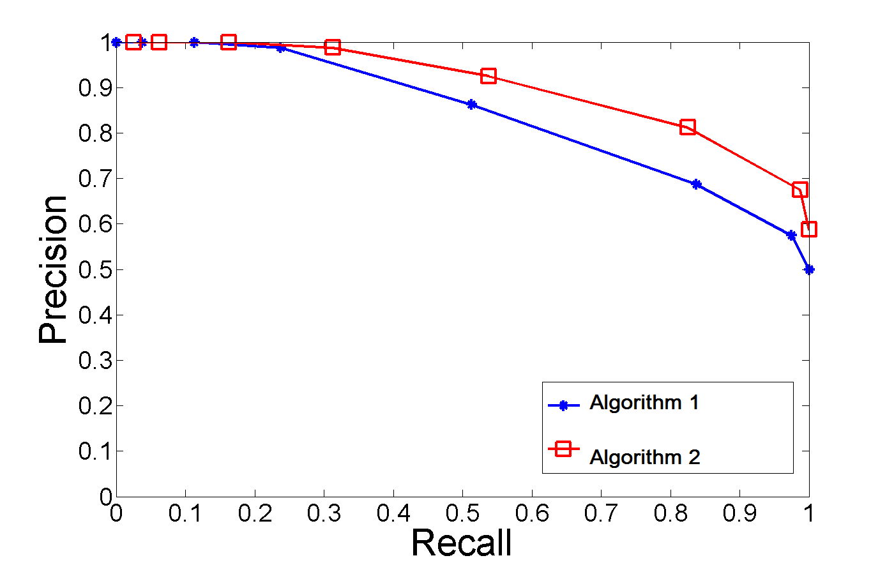
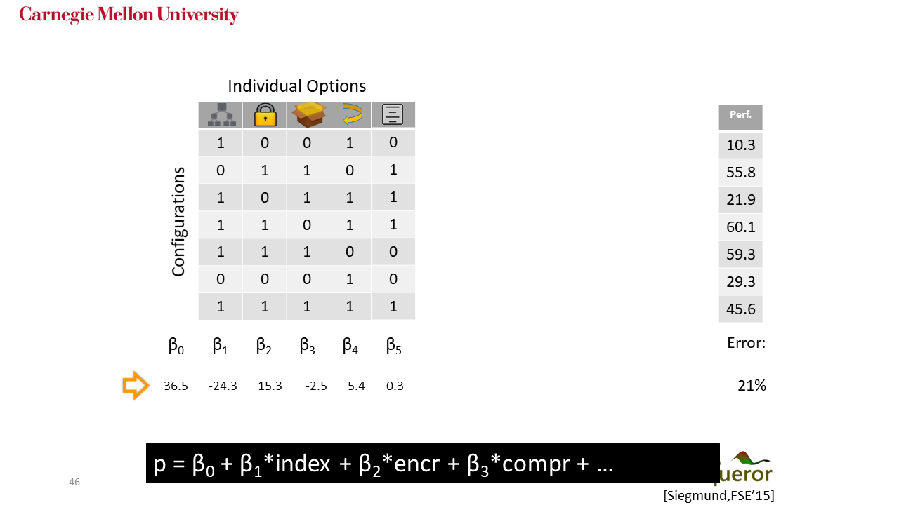
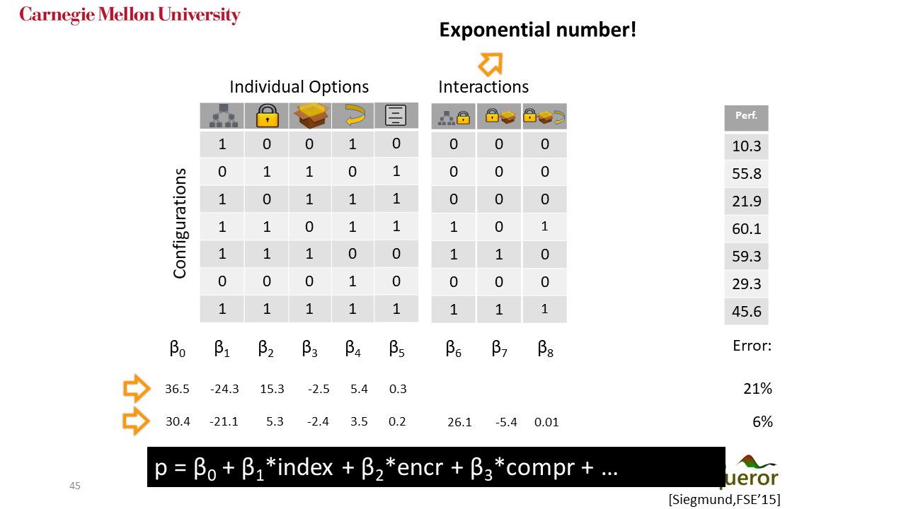
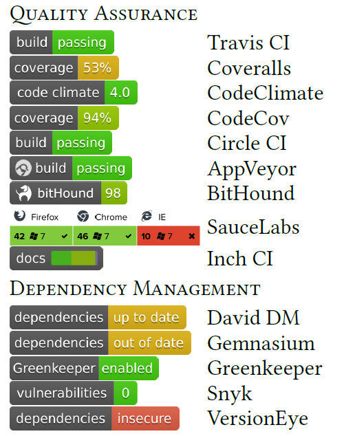
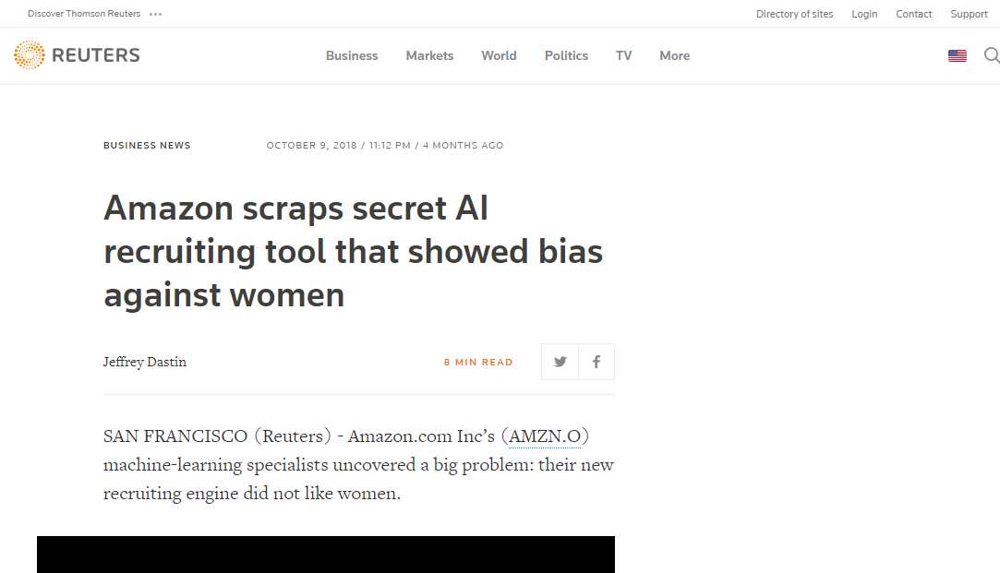
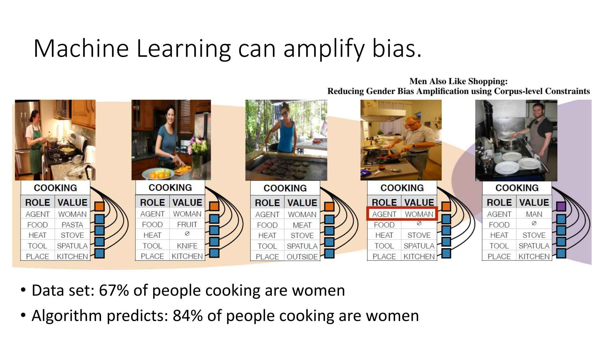
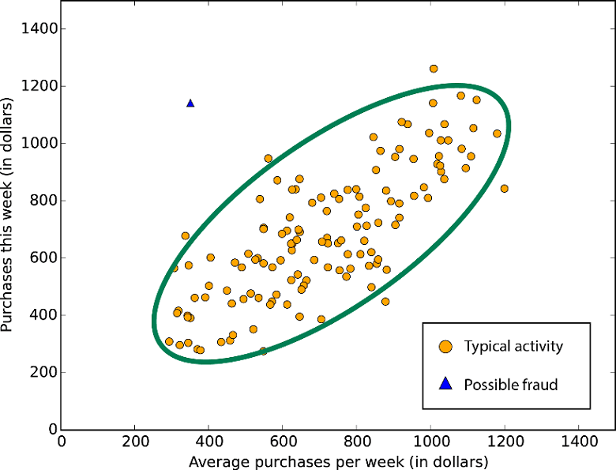

---

## Learning Goals

* Understand the challenges of testing AI components of a system

* Understand the basic steps of a machine learning pipeline

* Apply measures of model quality

* Select mechanisms to assure data quality in production, e.g., detect drift

* Describe opportunities for QA automation in a machine learning pipeline

* Apply basic tests for sensitivity, fairness

---

<!-- smallish -->
## New Course: Software Engineering for AI-Enabled Systems

https://ckaestne.github.io/seai/

* What changes with AI? Requirements, Architecture, Operations, Quality assurance, Process
* Going beyond Jupyter notebooks, operating AI-enabled systems in practice at scale
* Software engineering view on AI/ML craze

<!-- split -->

---

# Case Study

----

----

## Predicting Delivery Times

What factors may it depend on?

What can be used for learning and prediction?

How to evaluate accuracy?

One model or multiple?

---

# Machine Learning Pipeline

----

<!-- smallish -->

## Typical ML Pipeline

- Static
  - Get labeled data
  - Identify and extract features
  - Split data into training and evaluation set
  - Learn model from training data
  - Evaluate model on evaluation data
  - Repeat, revising features

- With production data
  - Evaluate model on production data; monitor
  - Select production data for retraining
  - Update model regularly

----

<!-- small -->

## Example Data

| RestaurantID | Order| OrderTime|ReadyTime|PickupTime|
|-|-|-|-|-|
| 5 |5A;3;10;11C;C:No onion| 18:11|18:23|18:31|
|...|
|...|
|...|

----

## Feature Engineering

* Identify parameters of interest that a model may learn on

* Convert data into a useful form

* Normalize data

* Include context

* Remove misleading things

* In delivery prediction:

----

## Features?

----

## Feature Extraction

In delivery prediction:

* Order time, day of week
* Average number of orders in that hour
* Order size
* Special requests
* Order items
* Preparation time

----

## Data Cleaning

Removing outliers

Normalizing data

Missing values

...

----

## Data cleaning?

----

## Learning

Build a predictor that best describes an outcome for the observed features

| RestaurantID | Order3 | SpecialRequest | DayOfWeek | PreparationTime |
|-|-|-|-|-|
|5|yes| yes|2|12|
|...|
|...|
|...|

----

## Evaluation

* Prediction accuracy on learned data vs prediction accuracy on unseen data

  * Separate learning set, not used for training

* For binary predictors: false positives vs false negatives, recall, precision

* For numeric predictors: average (relative) distance between real and predicted value

* For ranking predictors: topK etc

----

## Recall/Precision

* Describes accuracy of a model in two (relative) numbers

* Recall~: how many useful answers

* Precision~: how much noise
 
<!-- split -->

----

## Evaluation Data?

----

## Underfitting, Overfitting

* **Overfitting**: Model learns exactly the input data, but does not generalize to unseen data

* **Underfitting**: Model makes very general observations but poorly fits to data

* -> Adjust degrees of freedom in the model to balance between overfitting and underfitting

----
## Underfitting example

<!-- colstart -->

|Text|Genre|
|-|-|
|When the earth stood ... |Science fiction|
|Two households, both alike...|Romance|
|To Sherlock Holmes she...|Adventure|

<!-- col -->
```mermaid
graph TD;
    r[contains 'love'] --> romance
    r-->b[contains 'laser'] 
    b--> s[science fiction]
    b-->adventure
```

<!-- colend -->
----
## Overfitting example

<!-- colstart -->

|Text|Genre|
|-|-|
|When the earth stood ... |Science fiction|
|Two households, both alike...|Romance|
|To Sherlock Holmes she...|Adventure|

<!-- col -->
```mermaid
graph TD;
    f[first word = when]
    s[second word = the]
    t[third word = earth]
    f-->s
    f-->...
    s-->t
    s-->....
    t-->x[science fiction]
    t-->.....
```

<!-- colend -->

----
## Recall/Precision under different Thresholds

----

## Comparing Recall/Precision under different Thresholds

----

## Learning and Evaluating in Production

* Beyond static data sets, build telemetry

* Design challenge: identify mistakes in practice

* 

* Use sample of live data for evaluation

* Retrain models with sampled live data regularly

* Monitor performance and intervene

----

## Code vs Data Quality

* Functional correctness of source code (specification)

* Does the learner correctly implement the math to do the right predictions?

* Suitability of data/model for a task (goal optimization)

* Is the data representative to learn the underlying relationship?

* Is the data sufficient to generalize a well-fitting model?

* Is the data/model misleading or biased or noisy?

---

# Data Drift and Feedback Loops

----

## Can predictions influence the delivery times?

----

## What changes in the real-world may influence delivery times?

----

## Can a restaurant game the predictions?

----

## Data Drift and Feedback Loop

* Predictions depend on data, data changes

* Data may change; changes might be subtle: Data drift

  * e.g., new restaurants, seasons, restaurant popularity, staff shortage

* Predictions can affect user behavior and thus data: feedback loops

  * e.g., restaurant hiring more cooks in response to demand

* Adversaries and gaming

  * e.g., prioritizing delivery orders during learning period, underreporting preparation times, ...

----

## Detecting Data Drift

* Test performance on live data, monitor accuracy

  * anomalies, slow degradation

* Test for changes in input data and features

  * schema conformance

  * value distribution aligning with distribution in learning set?

  * various statistical methods

* Anticipate, test and monitor!

----

## Detecting Feedback Loops

* Deliberate design: Analyze problem and environment for likely feedback loops

* Architecture analysis: Which models use outputs of other models?

* Perform risk modeling, e.g., fault trees

* Think like an adversary

* 

* Design thinking, modeling!

----

---

# Unit Testing for Data

----

## Unit testing for data

* Check invariants in static and runtime data
* Conformance to schema (bugs!)
* Conformance to expected distributions (drift! outliers! attacks!)
* Expected relationships within the data (e.g., dependencies or correlations)
* Data does not contain inappropriate features (e.g., privacy)
* ...
* 
* Heuristics to check for typical problems…

----

## What to Test?

----

## Versioning of Data and Models

* Ensure reproducibility
* Treat data and models and configuration like code/binaries – version control, reproducible builds (feature extraction, learning, ...)
* Document and version parameters (“configuration as code”)
* Archive and version models with unique names
* Challenge: large data sets, pointer to cloud databases etc

----

## What to Version?

----

## Test ML Pipelines

* Test feature extraction code on static data and production data
* Code review of model specifications and feature extraction code
* Test the effect of stale models
* Test against simpler baseline models and heuristics
* Test model quality on specific important datasets
* Test reproducibility of training
* Integration test of full pipeline from data to model

----

## Test Model Deployment

* Test that different model variants and versions can be used for different tasks/consumers
* Canary testing for model deployment
* Test how fast and safely a model can be rolled back
* Measure model age, detect staleness
* Monitor prediction quality in production
* Monitor training and evaluation latency and model size

*Further reading: The ML Test Score: A Rubric for ML Production Readiness and Technical Debt Reduction by Eric Breck, Shanqing Cai, Eric Nielsen, Michael Salib, D. Sculley.*

---

# Sensitivity Analysis and Fairness

----

## Sensitivity Analysis

* Method to detect which model parameters are important
* Analysis of a model by testing the model with different inputs
* Origin in policy and physics models
  * also “what if”-analysis
  * e.g., which parameters are really important for high-leverage decisions; where should we focus our energy in discussion and research?

*Further reading: Saltelli, Andrea, et al. Global sensitivity analysis: the primer. John Wiley & Sons, 2008.*

----

## Sensitivity Analysis: Typical Process

* One at a time method:
  * Pick random values and get output of model
  * Flip a single feature in all values and get output of model
  * Observe typical difference between two values
  * Repeat for other features
* Random sampling:
  * Learn a simpler (interpretable) model from random samples
  * Identify important model parameters
* Many other sampling strategies exist to cover large spaces (see “design of experiments”)
* Some features will have no or little influence, some parameters very consistent large effects, others very noisy effects

----

----

----

What Features are Most Useful?

----

## Robustness

* How much does a model depend on a specific operationalization of a feature?
  * can we measure delivery time with a different method and still get similar results?
  * does our feature “gender”/”income” need to be very accurate for our model to work effectively?
  * how sensitive is our model to outliers?
* Evaluate model accuracy with different features or versions of feature extractors

----

Example Data Analytics Question: What encourages better dependency management practices?

<!-- colstart -->

<!-- col -->

<!-- colend -->

----
GitHub Stars as Popularity Measure

*Many ways to operationalize “project popularity”, e.g., stars or downloads. Test whether results are robust to different operationalizations.*

<!-- split -->

----

# Fairness

* Sensitivity analysis with regard to sensitive parameters
  * gender, race, …
* Evaluate loss in accuracy if sensitive features removed
* Careful with correlation
  * A is sensitive, not used for learning
  B correlates with A, B used for learning
  * Model likely still biased for A
* Lots of attention recently, lots of research

----

----

https://www.infoq.com/presentations/unconscious-bias-machine-learning
----

## Fairness Issues?

---

# Anomaly Detection

----

----
## Anomaly Detection

* Find outliers in dataset
  * point anomalies
  * contextual anomalies
  * collective anomalies
* Anomalies can indicate bugs, attacks, new requirements, data drift, …
  * intrusion detection
  * fraud detection
  * medical/health anomaly detection
  * industrial damage detection
  * ...

*Further reading: Chandola, Varun, Arindam Banerjee, and Vipin Kumar. "Anomaly detection: A survey." ACM computing surveys (CSUR) 41.3 (2009): 15.*

----

## Anomaly detection techniques

* Supervised vs unsupervised learning

* Various learning techniques

  * classification based

  * nearest neighbor

  * clustering based

  * statistical techniques

  * information-theoretic techniques

  * spectral techniques

----

----
## Anomaly Detection?

---
# More QA for ML/AI

----

## Risk Analysis

* AI components make mistakes

  * What are the consequences of mistakes? Worst case outcomes?

  * How can they be mitigated?

  * How reliable are those mitigation strategies?

* Requirements and risk analysis

* Review of requirements

* Think like an adversary

* Fault tree analysis

----

## Test Coverage

* Coverage of the input space in training data?

* Coverage of connections in neural network?

* Representativeness of learning data or static testing data of real-world data?

----

## Hyperparameter Tuning

* Many learning techniques have parameters

* Parameters can influence performance significantly

* Tuning techniques exist, often more effective than changing modeling technique

* Track model parameters like code/configuration

---

<!-- smallish -->
## New Course: Software Engineering for AI-Enabled Systems

https://ckaestne.github.io/seai/

* What changes with AI? Requirements, Architecture, Operations, Quality assurance, Process
* Going beyond Jupyter notebooks, operating AI-enabled systems in practice at scale
* Software engineering view on AI/ML craze

<!-- split -->

---

## Summary

* AI-enabled systems optimize for goals; no clear specification/oracle

* Learning+evaluation on static data set vs live data

* Key problems: data drift, feedback loops, adversaries

* Evaluation of data and model quality, testing of entire pipelines

* Sensitivity analysis and anomaly detection are powerful tools

