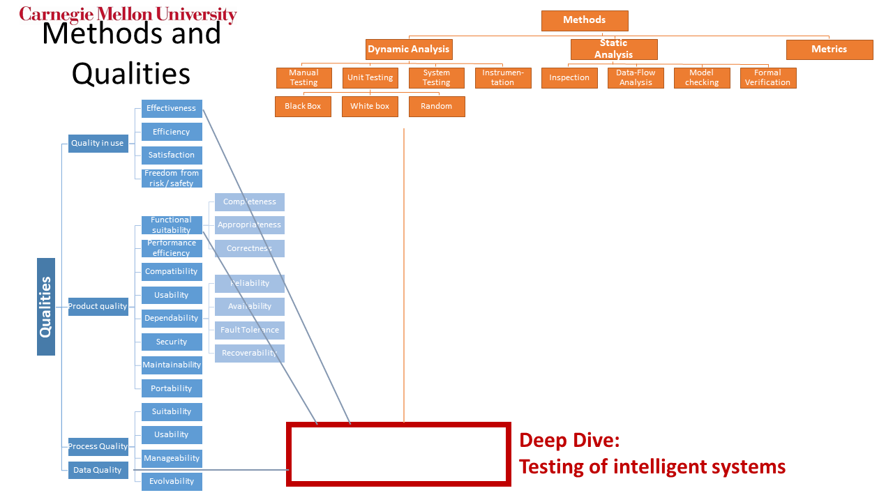

---

<!-- small --> 
# Learning Goals

* Understand the challenges of testing AI components of a system

* Understand the basic steps of a machine learning pipeline

* Apply measures of model quality

* Select mechanisms to assure data quality in production, e.g., detect drift

* Describe opportunities for QA automation in a machine learning pipeline

* Apply basic tests for sensitivity, fairness

---

<!-- small -->

# <!-- fit --> Fall 2019: New Course: Software Engineering for AI-Enabled Systems

<!-- colstart -->
https://ckaestne.github.io/seai/
* What changes with AI? Requirements, Architecture, Operations, Quality assurance, Process
* Going beyond Jupyter notebooks, operating AI-enabled systems in practice at scale
* Software engineering view on AI/ML craze

<!-- col -->

<!-- colend -->

<!-- /small -->

---

# Case Study

---

# Order?

---

## Predicting Delivery Times

What factors may it depend on?

What can be used for learning and prediction?

How to evaluate accuracy?

One model or multiple?

---

# Machine Learning Pipeline

----

## Typical ML Pipeline

- Static
  - Get labeled data
  - Identify and extract features
  - Split data into training and evaluation set
  - Learn model from training data
  - Evaluate model on evaluation data
  - Repeat, revising features

- With production data
  - Evaluate model on production data; monitor
  - Select production data for retraining
  - Update model regularly

----

<!-- small -->

## Example Data

| RestaurantID | Order| OrderTime|ReadyTime|PickupTime|
|-|-|-|-|-|
| 5 |5A;3;10;11C;C:No onion| 18:11|18:23|18:31|
|...|
|...|
|...|

